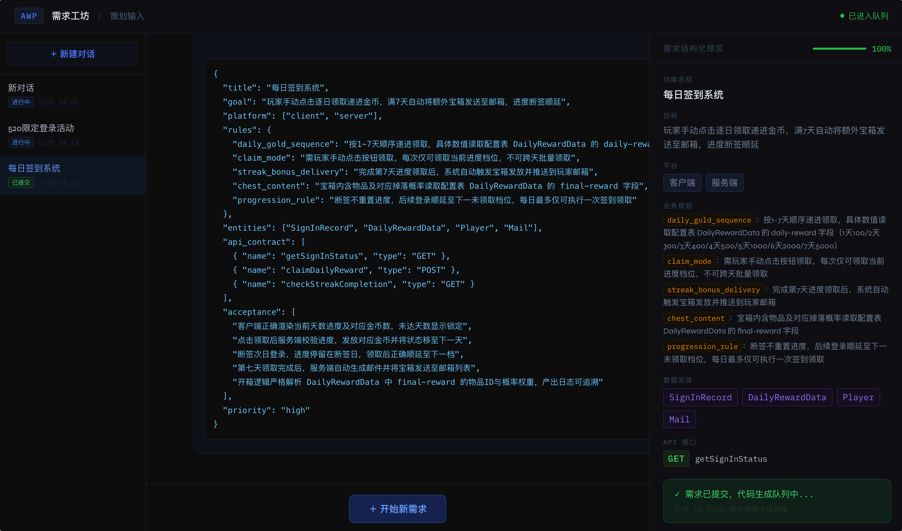
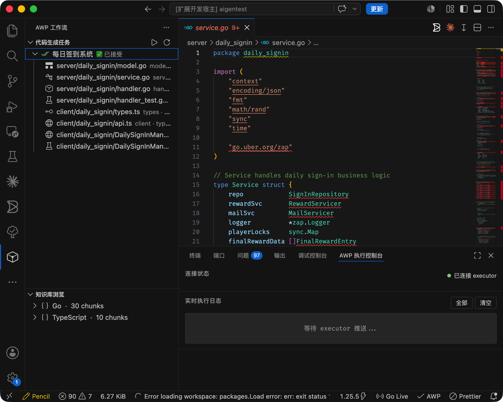

# AWP — AI Workflow Platform

> **AI 驱动的全链路自动化研发工作流平台**
> 从需求白话描述到生产代码，自动化率 >80%~~，支持游戏、客服、数据分析、公文处理等多领域。~~

[](LICENSE)
[](docker-compose.yml)
[](https://www.typescriptlang.org/)
[](https://golang.org/)

---

### 📊 代码统计

| 语言 | 代码行数 |
| :--- | :--- |
| **JavaScript** | 5,414,532 |
| **TypeScript** | 1,962,106 |
| **HTML** | 3,296 |
| **CSS** | 3,013 |
| **Go** | 611 |
| **Shell** | 311 |
| **总计** | **7,383,869** |


---

## ✨ 核心能力

```
策划白话输入
    ↓  AI 对话补全（最多5轮追问，完整度≥90%才可提交）
结构化 Spec（JSON）
    ↓  Hybrid RAG 知识库检索（BM25关键词 + 向量语义 + Neo4j调用图谱，只注入接口契约不注入实现体）
代码生成（Go / TypeScript / Unity C# / Java / Python，多端并发生成）
    ↓  Docker 沙箱自动测试（go test + jest 等并发执行）
          ↓ 初次测试
          ├─ 通过 ──────────────────────────────────────────────────────────────────┐
          └─ 失败                                                                   │
               ↓  判断错误类型是否可修复                                             │
               ├─ 不可修复（缺依赖/超时/无文件）→ 直接进人工                         │
               └─ 可修复 → Auto-Fix 循环                                             │
                    │                                                                │
                    ├─ 第1次 direct_fix                                              │
                    │   直接针对错误信息打补丁，保持原有架构                          │
                    │   ↓ 重新测试                                                   │
                    │   ├─ 通过 ─────────────────────────────────────────────────────┤
                    │   └─ 仍失败                                                    │
                    │        ↓                                                       │
                    ├─ 第2次 rethink_then_fix                                        │
                    │   先分析根因（接口理解偏差？边界条件？并发安全？）再修          │
                    │   ↓ 重新测试                                                   │
                    │   ├─ 通过 ─────────────────────────────────────────────────────┤
                    │   └─ 仍失败                                                    │
                    │        ↓                                                       │
                    └─ 第3次 simplify_then_fix                                       │
                        去掉复杂逻辑，逐条对照验收标准用最直接方式实现               │
                        ↓ 重新测试                                                   │
                        ├─ 通过 ──────────────────────────────────────────────────────┤
                        └─ 仍失败 → 进人工（携带3次完整修复历史）                    │
                                                                                     │
    ┌────────────────────────────────────────────────────────────────────────────────┘
    ↓  VS Code 插件（批量Diff / 局部接受 / 评分反馈）
生产代码合并
    ↓  评分（测试通过率 + 覆盖率 + 人工打分）+ 失败样本写入进化引擎 + 记忆沉淀
AI 越用越准
```


## 使用效果图





**平台特性：**
- 🎮 **游戏领域开箱即用**：Go 服务端 + TypeScript 客户端 + Unity3D C# 三端同步生成
- ~~🔌 **多领域可扩展**：智能客服 / 数据分析师 / 公文处理，改配置不改代码~~
- 🤖 **多 Agent 协作**：Spec分析 → 代码生成 → 测试 → 重构，DAG 并发调度
- 🧠 **记忆进化**：四层记忆系统（会话/长期/技能/用户），越用越精准
- 🔧 **动态配置**：Skill/Agent/LLM/知识库全部数据库驱动，后台管理无需改代码
- 🌐 **14+ LLM 支持**：Claude / GPT / DeepSeek / Gemini / Qwen / GLM / Ollama 等
- 📦 **智能依赖管理**：沙箱自动扫描 import 语句，按需注入 npm / Go 模块

---

## 🏗 系统架构

```
┌─────────────────────────────────────────────────────────────────┐
│                        前端层                                    │
│  planner-web（策划输入）  admin-web（管理后台）  VS Code 插件     │
└────────────────┬──────────────────┬──────────────────────────────┘
                 │ WebSocket        │ REST API
┌────────────────▼──────────────────▼──────────────────────────────┐
│                        服务层                                    │
│  spec-normalizer  →  code-generator  →  executor                 │
│       需求标准化        代码生成          测试+Auto-Fix            │
│                                                                  │
│  retrieval（检索）  admin（管理API）  memory（记忆）              │
└────────────────┬──────────────────────────────────────────────────┘
                 │
┌────────────────▼──────────────────────────────────────────────────┐
│                      Agent 系统                                   │
│  SpecAgent → CodeGenAgent → Unity3DAgent → TestAgent → RefactorAgent│
│              TaskBus DAG 并发调度  |  动态 Skill 加载              │
│              LLM Router（9种Provider）                            │
└────────────────┬──────────────────────────────────────────────────┘
                 │
┌────────────────▼──────────────────────────────────────────────────┐
│                      基础设施层                                   │
│  Kafka（消息队列）  PostgreSQL（业务数据）  Redis（缓存/会话）     │
│  Neo4j（代码图谱）  Chroma（向量库）        ES（BM25检索）         │
│  Prometheus + Grafana（监控）  SonarQube（质量扫描）              │
└───────────────────────────────────────────────────────────────────┘
```

---

## 📊 项目完成度

### 核心功能（Phase 1-5）
- ✅ **Phase 1**: 前端多语言选择 UI（100%）
- ✅ **Phase 2**: 代码生成多语言支持 5 种语言（100%）
- ✅ **Phase 3**: 动态 Skill/Agent 加载系统（100%）
- ✅ **Phase 4**: Agent 运行时集成（100%）
- ✅ **Phase 5**: 动态管道选择 + 前端管理 UI（100%）

**总体完成度**: 🟢 **99%** — 核心平台生产就绪

### Tier 5（可选生产加固）
| 组件 | 完成度 | 状态 | 备注 |
|------|--------|------|------|
| Kong API Gateway | 85% | ⏳ 可用 | 开发/测试可用，生产需强化 |
| GitHub Actions CI/CD | 95% | ✅ 完整 | 已集成 |
| VS Code 插件 UI | 79% | ⏳ 已加固 | P0 安全改进已完成 |

### 最新更新（2026-05-21）
- 🎯 **Phase 5 完成**: 动态管道选择系统（spec-consumer/executor）+ 前端管理 UI
- 🔒 **VS Code P0 加固**: HTTP 重试机制 + 路径验证（网络韧性 + 安全性）
- 🔍 **系统审计**: Kong/VS Code 完整审计完成，开发指南已更新

---

## 🚀 快速开始

### 环境要求

| 工具 | 最低版本 | 用途 |
|------|---------|------|
| Docker Desktop | 24.0+ | 运行所有服务 |
| Node.js | 20.0+ | 运行脚本和前端 |
| Git | 2.0+ | 版本管理 |

### 1. 克隆并配置

```bash
git clone https://github.com/ShaoYongChao/ai-workflow-platform.git
cd ai-workflow-platform

# 复制环境变量模板
cp .env.example .env

# 编辑 .env，至少填入一个 LLM API Key
# 推荐：ANTHROPIC_API_KEY=sk-ant-xxx
# 管理后台：ADMIN_API_KEY=awp_admin_2024
```

### 2. 启动基础设施

```bash
# 启动数据库、消息队列等（第一次约 3-5 分钟）
./scripts/start.sh infra

# 等待所有服务健康（查看状态）
docker-compose ps
```

### 3. 初始化知识库

```bash
# 解析种子代码，构建 BM25 检索索引
node knowledge-base/scripts/build-index.js

# 构建 Neo4j 代码调用图谱（需要 Neo4j 已启动）
node services/graph/src/build-graph.js

# 可选：向量化写入 Chroma（需要 OPENAI_API_KEY，写入共享默认 collection）
# OPENAI_API_KEY=sk-xxx node knowledge-base/scripts/vectorize.js
# 或写入项目专属 collection（多租户隔离）
# OPENAI_API_KEY=sk-xxx node knowledge-base/scripts/vectorize.js --project=my-project
# 写完后在 .env 中加 ENABLE_VECTOR_SEARCH=true 即可启用向量检索
```

### 4. 验证端到端流程

```bash
# 不启动 Docker，直接验证所有核心逻辑
node scripts/e2e-test.js

# 使用真实 LLM 验证
ANTHROPIC_API_KEY=sk-ant-xxx node scripts/e2e-test.js
```

### 5. 启动应用服务

```bash
# 启动所有应用服务
./scripts/start.sh app

# 或者启动全部（含监控）
./scripts/start.sh
```

### 6. 访问各入口

| 服务 | 地址 | 说明 |
|------|------|------|
| 策划输入界面 | http://localhost:3000 | 策划用，白话描述需求 |
| **管理后台** | http://localhost:3007 | 配置 LLM/Skill/Agent/知识库 |
| Kafka UI | http://localhost:8080 | 查看消息队列状态 |
| Neo4j Browser | http://localhost:7474 | 查看代码调用图谱 |
| Prometheus | http://localhost:9090 | 系统指标 |
| Grafana | http://localhost:3005 | 可视化监控面板 |
| SonarQube | http://localhost:9000 | 代码质量扫描 |

---

## 📋 操作流程

### 策划使用流程

```
1. 打开 http://localhost:3000
2. 点击「开始描述需求」
3. 用自然语言描述功能（如：做一个每日签到系统）
4. AI 会主动提问补全缺失信息
5. 完整度达到 90% 后点击「提交并生成代码」
6. 在 VS Code 插件中查看生成结果
```

### 开发者使用流程（VS Code 插件）

```
1. 安装插件（开发模式：F5 打开 Extension Development Host）
2. 左侧活动栏找到 AWP 图标
3. 「任务列表」Tab 查看待 Review 的生成任务（支持离线缓存）
4. 右键任务 → 「批量对比所有文件」总览变更
5. 或点击语言节点（Go / TypeScript）逐个打开 Diff
6. 工具栏：✅ 全部接受 | 📋 局部接受（多选文件）| ❌ 拒绝
7. 接受时可评分（1-5星）+ 填写反馈，自动上报后台
8. 接受后文件写入本地项目，任务状态实时更新
```

### 管理员使用流程（管理后台）

```
1. 打开 http://localhost:3007
   （首次访问若提示认证，在浏览器控制台执行：
   localStorage.setItem('awp_admin_key', 'awp_admin_2024')
   然后刷新页面）
2. LLM 配置 → 添加/测试模型，设置默认模型
3. Skills → 添加自定义 Skill（4种执行方式）
4. Agents → 组合 Skill，设置角色 Prompt
5. 知识库 → 手动添加/删除代码片段
6. 系统设置 → 调整全局开关和参数
```

### 添加新功能到知识库

```bash
# 方式一：从现有代码库添加
node knowledge-base/scripts/add-seed.js src/your-feature/ --feature=your_feature

# 方式二：通过管理后台手动添加
# 访问 http://localhost:3007 → 知识库 → 添加条目

# 添加后重建索引
node knowledge-base/scripts/build-index.js
```

---

## 🔧 扩展新领域

只需改配置，不改代码：

```typescript
// 1. 在 services/agents/registry/agent-registry.ts 添加领域配置
'java-microservice': {
  name: 'java-microservice',
  language: ['java'],
  framework: 'Spring Boot 3',
  conventions: ['使用 Result<T> 包装响应', '禁止在 Controller 写业务逻辑'],
  outputFormat: 'code'
}

// 2. 或通过管理后台 → Skills → 添加（无需改代码）
```

详细扩展方案见 [docs/EXTENSIBILITY.md](docs/EXTENSIBILITY.md)

---

## 📁 项目结构

```
ai-workflow-platform/
├── docker-compose.yml          # 19个服务一键编排
├── .env.example                # 环境变量模板
├── scripts/
│   ├── start.sh                # 分阶段启动脚本
│   └── e2e-test.js             # 端到端验证脚本
│
├── frontend/
│   ├── planner-web/            # 策划输入界面（Next.js 14）
│   ├── admin-web/              # 管理后台（Node.js 静态服务器 + 原生 HTML/JS）
│   │   ├── server.js           # 注入 API 地址和 Admin Key 的静态服务器
│   │   └── public/index.html   # 管理后台完整 UI（含 LLM/Skill/Agent 管理）
│   └── vscode-plugin/          # VS Code 插件（TypeScript Extension API）
│       └── src/
│           ├── extension.ts    # 插件入口
│           ├── commands/       # 批量Diff / 局部接受 / Accept / Reject 等命令
│           ├── views/          # TreeView（任务/知识库）+ 控制台 WebView
│           └── api/            # HTTP 客户端 + WebSocket 客户端
│
├── services/
│   ├── spec-normalizer/        # 需求标准化（WebSocket + LLM 对话）
│   ├── code-generator/         # 代码生成（Kafka 消费 + Multi-language）
│   ├── executor/               # 测试执行 + Auto-Fix + Review API
│   │   └── src/
│   │       ├── utils/sandbox.ts      # 沙箱（智能检测 npm/Go 依赖）
│   │       ├── runners/go-runner.ts  # Go 测试（含模块下载失败降级）
│   │       └── runners/ts-runner.ts  # TS 测试（jest + 兼容重试）
│   ├── retrieval/              # 知识库检索服务（Hybrid RAG，Phase 2）
│   ├── admin/                  # 管理后台 API
│   ├── agents/                 # 多 Agent 协作系统
│   │   ├── base/               # BaseAgent 抽象基类
│   │   ├── bus/                # TaskBus（DAG 调度）
│   │   ├── skills/             # 内置 Skill 库
│   │   ├── agents/             # 专职 Agent（Spec/CodeGen/Test/Refactor）
│   │   ├── unity-agent/        # Unity3D C# Agent
│   │   ├── registry/           # Agent 注册表 + 领域配置
│   │   └── dynamic/            # LLM Router（9种Provider）+ 动态加载器
│   ├── graph/                  # Neo4j 图谱构建和查询
│   ├── memory/                 # 记忆系统（Hemers 架构）
│   └── scorer/                 # 评分系统 + Prompt 进化引擎
│
├── gateway/
│   ├── tenant-middleware.js    # 多租户隔离中间件
│   └── tenant-db.js            # 租户感知 DB 查询
│
├── knowledge-base/
│   ├── seed-code/              # 种子代码（Go + TS + C# 参考实现）
│   ├── index/kb.json           # BM25 检索索引（自动生成）
│   └── scripts/                # 索引构建/向量化/添加种子脚本
│
├── infra/
│   ├── postgres/               # 数据库初始化 SQL（业务表 + 配置表）
│   └── prometheus/             # 监控采集配置
│
├── shared/
│   ├── types/                  # 跨服务共享 TypeScript 类型
│   └── prompts/                # 动态约束文件（进化引擎维护）
│
└── docs/
    ├── ARCHITECTURE.md         # 系统架构详解
    ├── SKILL_AGENT_SPEC.md     # Skill/Agent 填写规范
    ├── EXTENSIBILITY.md        # 扩展到其他领域的方案
    ├── API.md                  # API 接口文档
    └── COMPLETION_REPORT.md    # 完成度分析报告
```

---

## 🛠 技术栈

| 层次 | 技术选型 | 说明 |
|------|---------|------|
| 前端（策划） | Next.js 14, TypeScript | App Router, WebSocket 流式 |
| 前端（管理） | Node.js 静态服务器, 原生 HTML/JS | 无构建步骤，注入运行时配置 |
| VS Code 插件 | TypeScript, VS Code Extension API | TreeView / WebView / Diff |
| 服务端 | Node.js 20, TypeScript, Express | 微服务架构 |
| 消息队列 | Apache Kafka | 异步任务解耦 |
| 关系数据库 | PostgreSQL 16 | 业务数据 + 配置 |
| 向量数据库 | Chroma 0.4 | 语义检索 |
| 图数据库 | Neo4j 5.15 | 代码调用关系 |
| 搜索引擎 | Elasticsearch 8.11 | BM25 关键词检索 |
| 缓存 | Redis 7.2 | 会话/任务状态 |
| 监控 | Prometheus + Grafana | 指标采集和可视化 |
| 代码质量 | SonarQube 10.3 | 质量门禁 |
| 容器化 | Docker + Docker Compose | 一键部署 |

---

## 📖 文档索引

### 核心文档
| 文档 | 说明 | 最后更新 |
|------|------|---------|
| [CHANGELOG.md](CHANGELOG.md) | 完整变更日志（所有Phase + 安全改进） | 2026-05-21 |
| [docs/ARCHITECTURE.md](docs/ARCHITECTURE.md) | 详细架构设计 + 数据流 | 2026-05-21 |
| [docs/API.md](docs/API.md) | REST + WebSocket 接口文档 | 2026-05-21 |

### 使用指南
| 文档 | 说明 |
|------|------|
| [docs/SKILL_AGENT_SPEC.md](docs/SKILL_AGENT_SPEC.md) | Skill/Agent 填写规范 |
| [docs/EXTENSIBILITY.md](docs/EXTENSIBILITY.md) | 扩展到其他领域方案 |
| [knowledge-base/README.md](knowledge-base/README.md) | 知识库使用说明 |
| [frontend/vscode-plugin/README.md](frontend/vscode-plugin/README.md) | VS Code 插件使用说明 |

---

## 🤝 贡献指南

1. Fork 本仓库
2. 创建 feature 分支：`git checkout -b feature/your-feature`
3. 提交前运行验证：`node scripts/e2e-test.js`
4. 推送并创建 Pull Request

**添加新领域支持：**
1. 在 `services/agents/registry/agent-registry.ts` 中添加 `DOMAIN_CONFIGS`
2. 在 `knowledge-base/seed-code/` 添加该领域的种子代码
3. 运行 `node knowledge-base/scripts/build-index.js` 重建索引
4. 更新 `docs/EXTENSIBILITY.md`

---

## 📄 License

MIT License — 详见 [LICENSE](LICENSE) 文件
